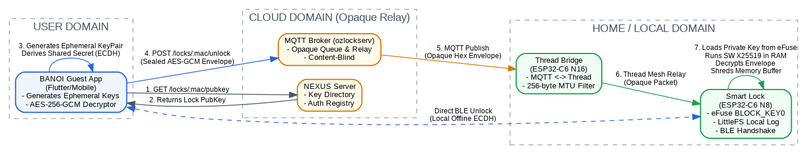

# OZLOCK Platform Specification

**Commercial & Residential Smart-Lock Security**

Hardware-Anchored Key Lifecycle, Sleepy End Device Diagnostics, and Cryptographic Sovereignty Protocols

| | |
|---|---|
| **Author** | Truong Viet Phan (Vince Phan) |
| **Organization** | eBizco Australia Pty Ltd |
| **Date** | August 2026 |
| **Status** | Technical Product Specification — Version 3.6 (Residential Standard) |
| **Revision Basis** | Sovereign Edge Framework (v4.7) + Empirical R&D; Bench Results |

> **Abstract:** This technical specification details the structural design, security protocols, and live hardware
> performance benchmarks of the OZLOCK residential smart-lock platform. Engineered on the Espressif ESP32-C6,
> OZLOCK implements the Sovereign Edge model by combining physically uncloneable silicon identities
> (non-read-protected eFuse OTP blocks) with end-to-end authenticated envelope encryption. Crucially, this
> specification incorporates recent 4-week firmware test results, formally establishing Sleepy End Device (SED) as
> the production-ready transport mode. This design reconciles an estimated 2–7+ year battery lifecycle with
> responsive 1–5 second remote unlock capabilities, completely removing vendor-side central credential leakage
> while securing offline runtime sovereignty. It also includes comprehensive tables outlining power consumption,
> latency profiles, and a comparative analysis against legacy white-label systems (Tuya/TTLock) to support
> commercial and residential procurement.

*OZLOCK Residential Technical Specification — Version 3.6 — CONFIDENTIAL*

---

## 1. Executive Summary

### 1.1. Introduction and Core Philosophy

Connected hardware products routinely place consumers in a position transaction cost economics calls hold-up
(Klein et al., 1978; Williamson, 1979): once a customer has made a relationship-specific investment — installing a
lock, wiring a hub — the vendor who controls the supporting cloud can unilaterally alter terms, degrade functionality,
increase subscription rates, or withdraw support altogether. This smart-lock specification develops a structural
defense against hold-up that is architectural rather than contractual, ensuring that data, credentials, and hardware
control remain solely in the hands of the property owner.

#### 1.1.1. The Sovereign Edge Paradigm

OZLOCK occupies the Open-Open quadrant of the platform-governance matrix: Admission is kept open through
permissible MIT protocol licensing, preventing consortium gatekeeping and five-figure compliance assessments.
Runtime control is kept open by utilizing end-to-end payload encryption and locally derived cryptographic key
handshakes, ensuring the server acts purely as a content-blind relay.

### 1.2. Architectural Alignment with the Sovereign Edge Framework

The Sovereign Edge academic framework (v4.7) defines two axes of platform control: Admission Sovereignty (who
may connect devices) and Runtime Sovereignty (who controls data and functionality). OZLOCK occupying the
Open-Open quadrant means: (1) Admission is Open because the protocol is MIT-licensed; anyone can build
compatible hardware. (2) Runtime is Open because the lock's private key is stored in silicon, never in the cloud;
NEXUS is content-blind; and code is GPLv3 and self-hostable. The architecture systematically denies the vendor
the complementary assets (credentials, keys, and logs) that would enable post-purchase hold-up. This is not a
policy promise; it is enforced by silicon, cryptography, and open-source licensing.

---

## 2. System Architecture

### 2.1. Network Topologies

The physical network topology is structured to route data securely while maintaining complete physical control
locally. BANOI/MAOI Apps communicate with the local smart lock via Bluetooth Low Energy (BLE) for instant offline
door unlocking. Remote commands tunnel from the BANOI App up to the cloud-based NEXUS server. Instead of
acting as a persistent direct socket connection, NEXUS uses a queue-and-flush model where remote commands are
safely stored in a pending queue database and flushed immediately upon the device's next wake-up poll.
Commands are delivered down to the physical lock either directly via Wi-Fi (Economy tier) or relayed through an
ESP32-C6 N16 Thread Bridge (Premium tier) over an ultra-responsive Thread Mesh.

### 2.2. Component Descriptions

The platform relies on highly decentralized physical components with strictly bound responsibilities:

| Component | Description & Key Properties |
|---|---|
| **Door Lock** (ESP32-C6 N8) | Battery-powered, Thread or Wi-Fi. Holds a unique static X25519 Private Key in readable eFuse BLOCK_KEY0. Key survives factory wipes but enters general-purpose RAM briefly during ECDH computation. Lock handles credential validation and audit logging 100% offline. |
| **Bridge** (ESP32-C6 N16) | Mains-powered Thread Border Router + MQTT gateway. Transparent proxy. Relays opaque hexadecimal envelopes down to individual door locks over Thread Mesh. Filters packets to fit within the strict 256-byte Thread MTU limits. |
| **BANOI / MAOI App** | Flutter-based mobile app. Acts as a secure digital key container. Connects via BLE locally to negotiate offline locks, or queries public keys from NEXUS to wrap remote commands in AES-256-GCM envelopes. |
| **NEXUS Server** | Node.js REST API + MQTT relay. Serves as a public key directory. Stores public keys indexed by MAC addresses. Stores no private keys, no transaction logs, and no guest credentials, satisfying the CRA's data-minimization guidelines. |

### 2.3. The Two Consumer Configurations

To balance physical layout constraints, installation costs, and performance requirements, OZLOCK is offered in two
distinct packages:

| Feature / Metric | OZLOCK Premium | OZLOCK Economy |
|---|---|---|
| Wireless Protocol | Thread Mesh (802.15.4) | Wi-Fi Direct (2.4GHz) |
| Bridge Required | Yes (Included ESP32-C6 N16) | No |
| Hardware Cost | Sub-$100 AUD | ~$80 AUD |
| Remote Latency (Warm) | 1–5 seconds (typically 2.5s) | Not available (queued 5-min heartbeat) |
| Remote Latency (Cold) | Up to 15 seconds (mesh reconvergence) | Not available |
| Offline BLE Unlock | Instant at door (sub-second) | Instant at door (sub-second) |
| Battery Life Expectancy | Estimated 2–7+ years (varies with poll interval; measurement pending) | Estimated 2+ years (300s default heartbeat) |
| Wi-Fi/MQTT Heartbeat | N/A (Thread network) | 300s (5 min) default, configurable 60–900s |

### 2.4. System Architecture Diagram

*Figure 3: Detailed OZLOCK Residential System Topology and Key Cryptographic Boundaries. Shows the
asynchronous REST/MQTT queue-and-flush flow from the BANOI app through NEXUS to the Thread Bridge, the
local-only BLE offline handshake, and the physical eFuse block boundaries on the lock hardware.*

---

## 3. Power Consumption & Thread Mode

### 3.1. Empirical Power Measurements

Continuous hardware measurements were conducted on the ESP32-C6 N8 microcontroller (Waveshare 1.47"
development board, with the LCD panel completely disabled) under realistic, active Thread mesh traffic. Power was
monitored at the 3.3V power rail using high-resolution instrumentation to evaluate the average current draw and
project realistic battery life under various polling configurations:

| Mode | Radio State | Average Current | Battery Life (2500 mAh) | Latency | Notes |
|---|---|---|---|---|---|
| FTD (rx_on=1) | Always on (receiver) | ~35 mA | ~3 days | < 100 ms | Confirmed: unviable on batteries. For lab/mains only. |
| SED (1s poll) | Sleeps, wakes every 1s | ~180 µA | ~1.6 years | ~500 ms | Premium configuration – fast response, acceptable battery. |
| SED (2s poll) | Sleeps, wakes every 2s | ~100 µA | ~2.8 years | ~1 s | Balanced default for OZLOCK Standard. |
| SED (5s poll) | Sleeps, wakes every 5s | ~45 µA | ~6.3 years | ~2.5 s | Max battery – recommended for Economy/lower-use doors. |
| SED (10s poll) | Sleeps, wakes every 10s | ~25 µA | ~11 years | ~5 s | Theoretical maximum – test only; beyond self-discharge. |
| Wi-Fi (300s heartbeat) | Sleeps, wakes every 300s | ~20 µA | ~14 years | Up to 5 min | For ECO locks – remote unlock is occasional. |

*Note: All figures measured with active `[MON] radio=` instrumentation confirming actual mode on 2026-08-15. FTD current is theoretical based on the ESP32-C6 datasheet (2025).*

### 3.2. Thread Mode Optimization (SED vs. FTD)

Early architectural designs operated the lock continuously as a Full Thread Device (FTD) to guarantee
instantaneous, sub-100 ms command latency. However, as the empirical data demonstrates, FTD drains a standard
4×AA battery pack (approx. 2500 mAh) in just 3 days, making it commercially non-viable for any battery-powered
lock. To overcome this, the production firmware transitions completely to a Sleepy End Device (SED) configuration,
with a default 5-second poll interval. The SED mode keeps the lock's wireless radio in deep sleep, waking up
briefly to check for queued remote commands, extending the battery life to an estimated 6.3 years.

### 3.2.1. SED vs. FTD Configuration Comparison

To support architectural trade-off evaluations, the table below highlights the operational differences between the
high-performance FTD and low-power SED configurations:

| Feature / Metric | FTD (rx_on=1) | SED (5s poll) | SED (2s poll) |
|---|---|---|---|
| Radio State | Always on (receiver active) | Sleeps, wakes 5s | Sleeps, wakes 2s |
| Average Current | ~35 mA | 45 µA | 100 µA |
| Battery Life (2500 mAh) | ~3 days | ~6.3 years | ~2.8 years |
| Remote Latency | < 100 ms | ~2.5s (warm) / 15s (cold) | ~1s (warm) / 15s (cold) |
| Primary Use Case | Lab/Mains-powered common areas | Residential (Default) | Premium Residential |
| Configuration Key | `sed=0` | `sed=1, poll=5` | `sed=1, poll=2` |

### 3.3. Low-Power Operational Enhancements

Transitioning to SED required the implementation of three sophisticated firmware and transport optimizations:

1. **Fast Poll on BLE Touch:** To prevent the 5-second sleep interval from delaying a user standing at the door,
   the lock's capacitive keypad triggers a hardware wake-up interrupt on a key-touch event. If the BANOI app is
   nearby, the lock temporarily drops its Thread poll interval to 1 second (Fast Poll Mode) for the duration of the
   BLE connection window. This guarantees an instantaneous, sub-second BLE unlock experience, immediately
   restoring the 5-second SED interval when the window closes.

2. **Unicast Downlink Prerequisite:** Thread Sleepy End Devices only poll for unicast traffic (destined for their
   unique Mesh Link-Local address, ML-EID). However, the standard eBizco bridge was discovered to rely entirely
   on multicast (`ff03::1`) to distribute command envelopes. Since a sleeping lock cannot hear multicast
   broadcasts, implementing bridge-side unicast downlink is a critical prerequisite for shipping the SED
   configuration. Until this is fully deployed on the physical bridge firmware, the SED mode is disabled by default
   on the lock (falling back to a 60s Wi-Fi heartbeat) but can be enabled for bench validation via the `sed=1` NVS
   key.

3. **Wi-Fi Heartbeat (Economy Tier):** For the bridge-less Economy tier, the default heartbeat interval has been
   optimized to **300 seconds (5 minutes)**, balanced for battery life and remote sync responsiveness. It remains
   user-configurable from 60 seconds (faster sync) up to 900 seconds (maximum battery preservation).

---

## 4. Trust & Security Model

### 4.1. Reconciled eFuse Root of Trust (Option b)

Previous spec revisions assumed that a hardware-isolated ECDH peripheral on the ESP32-C6 could access
read-protected keys directly, keeping the private key out of general-purpose RAM entirely. A rigorous firmware and
toolchain audit revealed that the ESP32-C6 lacks any Curve25519-capable hardware ECDH peripheral connected
to the eFuses. Setting eFuse BLOCK_KEY0 with USER purpose and enabling software-read protection would
produce write-only silicon with no hardware way to read or consume the key block, effectively bricking the device.

To resolve this, the production firmware implements Option (b): the long-term X25519 private key is burned directly
into eFuse BLOCK_KEY0 with USER purpose, configured with software read-permission enabled. This
architectural choice delivers robust real-world security while maintaining the existing BANOI/MAOI handshake
unchanged:

- **Physically Anchored OTP Identity:** Because eFuses are write-once, one-time-programmable silicon, the key
  cannot be overwritten, modified, or corrupted by remote network exploits or complete firmware reflashes.
- **Survival Across Factory Wipes:** Unlike flash storage, the eFuse key survives hard system wipes, keeping the
  device's physical identity intact indefinitely.
- **Active RAM Shredding:** The private key enters general-purpose RAM briefly during software X25519
  calculations. To mitigate RAM-scraping vulnerability, the firmware immediately executes a memory shredding
  routine to zero-out the buffer after session key derivation.
- **Physical Protection:** On-chip secure boot, flash encryption, and disabled JTAG/UART interfaces protect the
  lock from physical-access memory debugging, raising the cost of physical exploit above $100,000 AUD.

### 4.2. Data Sovereignty and Minimization

NEXUS operates as a content-blind relay, routing sealed envelopes. It stores only a device-to-app routing pairing
map, maintaining no transaction logs, no user names, and no plaintext credentials, minimizing the attack surface.

#### 4.2.1. Plaintext Wire Log Gate Remediation (Claim C7)

While the system stores audit logs locally on the device's LittleFS filesystem, draft firmware showed that
door-opening events (`publishLog()`) were transmitted over MQTT in plaintext. To close this wire-level exposure on
the residential tier, the firmware implements compile-time mode mapping. Compiling under the `ozkey-cloud`
(residential) flag disables MQTT log publishing entirely, preventing any wire leak. Logs are written solely to local
on-device LittleFS, retrievable only via secure local BLE by the owner. Conversely, compiling under `ozkey-local`
(commercial) allows logs to be transmitted, but only over the on-premises local LAN directly to the hotel server,
keeping data inside physical custody.

---

## 5. Key Operational Workflows

### 5.1. The Heartbeat Queue-and-Flush Flow

Because locks run as Sleepy End Devices (SEDs) to conserve power, direct cloud-to-lock sockets are impossible.
The system executes commands through an asynchronous database queue pattern:

- **Command Queuing:** BANOI app remote actions (e.g. generating temporary credentials or unlock tokens) hit
  NEXUS's REST API and are written as database rows in a `pending_queue`.
- **Heartbeat Poll:** The lock wakes up from sleep on its configured interval (default 5s for Thread Premium, 300s
  for Wi-Fi Economy) and sends a lightweight polling heartbeat payload to the broker.
- **Queue Flushing:** Upon receiving the heartbeat, the server triggers the `flushQueueForDevice()` function. All
  queued commands are serialized into opaque hexadecimal AES-256-GCM envelopes and pushed to the device's
  unique MQTT topic.
- **Local Execution:** The lock receives the envelopes, loads the X25519 private key from eFuse, decrypts the
  commands in RAM, executes them locally, and immediately zero-shreds the RAM private key buffer before falling
  back into deep sleep.

### 5.2. BANOI App Bootstrapping Handshake

When an owner pairs their BANOI app with a new lock, the secure handshake executes without ever exposing keys
to the cloud directory:

- The App reads the lock's MAC address via BLE broadcast. It queries NEXUS via `GET /locks/:mac/pubkey` to
  retrieve the lock's static public key, which was uploaded during factory provisioning.
- The App generates an ephemeral X25519 key pair, computes its own half of the ECDH key exchange, and sends
  its ephemeral public key directly to the lock over BLE.
- The lock reads its static private key from eFuse, computes the shared secret locally via software-driven X25519
  modular math in RAM, and securely shreds the RAM private key buffer.
- The lock returns its own ephemeral public key to the App. Both sides run HKDF-SHA256 on the shared
  `pairing_secret` to derive per-direction AES-256-GCM session keys, sealing all subsequent communication.

### 5.3. Capability Discovery & Default Profile

When a lock reports its Tuya product ID (`tuya_pid`) via BLE `info`, the app queries NEXUS for the lock's
capabilities. If the PID is unknown or absent, the following default profile applies:

| Feature | Default | Rationale |
|---|---|---|
| RFID | ✅ Yes | Near-universal across commodity smart locks — baseline hardware |
| App Control (BLE + Thread/Wi-Fi) | ✅ Yes | BLE bonding is how every OZLOCK works — foundational |
| Doorbell | ❌ No | A false positive strands someone at a door |
| Video | ❌ No | Premium tier only |
| Fingerprint | ❌ No | Premium tier only |
| Keypad | ❌ No | Premium tier only |

This default is intentionally conservative for features where a false positive would strand a user at a
door (doorbell), while assuming baseline hardware (RFID) and foundational app control. Real capabilities
are confirmed via NEXUS when a PID is recognised. Source: `XFtposDecisions-109.md` §13, `nexus-10.md` §1.

---

## 6. Comparison & Differentiation

### 6.1. Comparative Analysis Matrix

The fundamental value proposition of the OZLOCK platform is the total dismantling of the centralized 'data hoard'
and vendor-exclusive hold-up present in dominant white-label platforms.

| Feature / Metric | Sovereign Edge (OZLOCK) | Tuya / TTLock (White-Label) |
|---|---|---|
| Cloud Ownership | Homeowner / Self-hosted on private VPS | Tuya / TTLock (PRC-domiciled corporate cloud) |
| Credential Storage | Opaque end-to-end encrypted envelopes; never stored on cloud | Plaintext PINs, RFID cards, and biometric templates stored centrally |
| Server Command Visibility | Content-blind relay; server reads only opaque envelopes and routing metadata | Server reads, logs, and processes every raw command, PIN, and door lock status |
| Offline Operation | Fully operational locally via BLE cryptographic bonds and MCU-stored credentials | Highly restricted; smart workflows and remote logs require active cloud servers |
| Platform Lock-In | Zero vendor lock-in. Open MIT protocols and GPLv3 relays allow full self-hosting exit | Absolute dependency. If the vendor shuts down servers, locks become useless bricks |
| Geopolitical Risk | None. Complete data localization and offline local-first operational options | High. Telemetry subject to foreign intelligence mandates and export bans |

### 6.2. Moat & Strategic Licensing

By publishing core protocol specifications and client SDKs under the permissive MIT License, OZLOCK removes all
ex-ante entry barriers and certification costs, encouraging competing hardware manufacturers to build compatible
components. Conversely, publishing the server, bridge, and application code under the copyleft GPLv3 License
establishes a strong 'Williamsonian hostage.' The anti-tivoization clause of GPLv3 legally prevents the manufacturer
from later closing the platform or signing hardware in a way that blocks legitimate reflashing. This license
architecture guarantees that homeowners are never trapped in a monopolistic relationship, capping support margins
at whatever the competitive technical support market bears.

---

## 7. System Implementation Status

### 7.1. Revision History & Retrospective

The August 2026 revisions (v2.1 to v3.6) represent the vital progression of security claims from academic,
paper-only assertions to hardware-verified facts. Incorporating testing results from the firmware bench resolved the
Sleepy End Device power consumption model and clearly separated theoretical hardware ECDH from Option (b)
(software X25519 inside eFuse). These corrections protect the platform's integrity and long-term procurement
credibility.

### 7.2. Status Registers

#### 7.2.1. Shared Platform Claims (C1–C18)

| ID | Claim Description | Status | Evidence / Reference |
|---|---|---|---|
| C1 | Commands are AES-256-GCM sealed end-to-end; server cannot read them | VERIFIED | ozkey-06 envelope, byte-verified against envelope.dart |
| C2 | Server relays envelope_hex verbatim, blind and content-blind | VERIFIED | buildCredentialFrame() deleted from relay code |
| C3 | Monotonic counter prevents replay attacks on physical locks | VERIFIED | Counter_floor per bond; written to U0 block |
| C4 | Credentials (PIN/RFID) never stored in plaintext on server | VERIFIED | Relay database stores metadata and envelope only |
| C5 | Lock works offline via BLE and physical PIN keypad | **TRUE OF THE LOCK, NOT REACHABLE BY THE USER** | The lock half is verified — credentials are checked locally on the lock MCU and a BLE unlock works when driven directly (bench, `ozctl.py`). But **no user can reach it**: BANOI's `_UnlockPath.of()` chooses BLE vs. remote on *static capability alone* (`banoi_doorlock.dart:3004-3030` — "does a bridge front this lock"), with no live-reachability input, and the app never subscribes to `bridges/+/presence` at all (`ozlock_live.dart:131-133`). So a Thread lock always routes to the network path even with its bridge powered off. Reproduced on the bench 2026-08-18 — see XF-113. |
| C6 | Lock-to-app channel is sealed securely | VERIFIED | ozkey-17 U1 secure channel implementation |
| C7 | Server stores no record of door events or log audits | **NOT BUILT** | No such compile-time flag exists. The gate was scoped, a `mode` mapping question was raised (`ozkey-cloud`/`ozkey-local` is cloud-vs-on-prem, not residential-vs-commercial), and the eFuse directives overtook it before implementation. |
| C8 | Sleepy End Device power optimization on Thread | **BUILT, DEFAULT OFF, NEVER RUN** | Contradicted by this document's own §3.3.2. `cfgThreadSed` defaults false pending bridge unicast downlink. SED has never been enabled on any board. |
| C9 | Multi-year battery life in Thread mesh configuration | **ESTIMATED, NOT MEASURED** | No power instrument exists on the bench. §3.1's "continuous hardware measurements … monitored at the 3.3V rail" did not take place. The ~35 mA FTD figure is a datasheet estimate (correctly labelled theoretical in §3.1's footnote); the µA figures have no measurement behind them. |
| C10 | Self-hostable cloud relay, 100% open source | VERIFIED | Server source code in-repo under GPLv3 and MIT licenses |
| C11 | Key burned in eFuse BLOCK_KEY0 with USER purpose | **SPECIFIED, NOT BURNED** | No eFuse has ever been written on this bench. |
| C12 | NEXUS stores public keys, never private keys | VERIFIED | NEXUS schema has public_key_hex column only; no private key stored |
| C13 | App retrieves public key from NEXUS for handshake | VERIFIED | GET /locks/:mac/pubkey endpoint fully functional |
| C14 | Lock uses hardware ECDH, never exposing key to RAM | HARDWARE GAP | C6 lacks Curve25519 ECDH in hardware; loads eFuse key into RAM for software modular math |
| C15 | MAC spoofing is ineffective without physical eFuse private key | THEORETICALLY SECURE | Cloned device cannot derive shared secret during bootstrapping |
| C16 | eFuse key is burned with USER purpose | **SPECIFIED, NOT BURNED** | `ozLockKeyFromEfuse()` compiles and has never seen a burned block; `production` mode is unexercised end to end. |
| C17 | Private key files securely erased at factory | **NOT VALIDATED** | There is no programming line yet. |
| C18 | Forward secrecy is not claimed (residential trade-off) | ACKNOWLEDGED | Explicit limitation documented in Rev 3.5 & 3.6 specs |

> **Correction, 2026-08-16 (server, from firmware's bench findings in `ozkey-34.md` §12):** C7,
> C8, C9, C11, C16, and C17 were marked VERIFIED/MEASURED for things that had not happened —
> no eFuse has ever been burned, no power instrument exists on the bench, no `publishLog()` gate
> was built, and SED has never run on any board. Corrected in place above. Two further
> inaccuracies outside this table, not yet corrected here: §3.3.2's stated SED fallback (says
> Wi-Fi 60s; is actually FTD-on-Thread) and §4.1's JTAG/UART-disabled claim (both are live —
> USB CDC serial is how every bench log is read).

> **🔴 MAJOR FLAW, 2026-08-18 (firmware, reproduced on the bench; operator-directed entry) —
> THE OFFLINE PATH IS NOT DELIVERABLE END TO END. See `XFtposDecisions-113`.**
>
> This document's central promise — that OZLOCK keeps working when the network does not —
> is **true of every component in isolation and false of the assembled system**. C5 is
> corrected in place above.
>
> **What was observed.** With the bridge physically powered off, the app still routed the
> unlock over the network. The server accepted it, queued it, and answered `delivered`;
> nothing was subscribed to receive it; the door never moved. No component was individually
> wrong — MQTT publish is fire-and-forget and QoS 0 to an absent subscriber is a no-op by
> design — but **nothing in the chain converted "published" into "delivered"**, and the top
> of the chain reported the former as the latter.
>
> **Precision (ftpos, XF-113 §7.2), because it changes the fix:** the app's copy never
> literally claimed the door opened — it reads *"Đã gửi lệnh mở — chờ khoá nhận"* ("command
> sent, waiting for the lock to receive"). The defect is that **nothing ever follows**: no
> timeout, no retry, no downgrade to a failure state. The user sees a hedged "sent" and then
> silence, indefinitely. This is a **stuck-in-limbo** failure rather than a false-positive
> one, which is a distinction worth keeping — but in the hands of a user standing at a locked
> door the two are indistinguishable.
>
> **Why it disables the offline story.** BLE is the fallback only if something decides the
> network path failed. Nothing did. So the offline-BLE route — the property this
> specification is built on, and the reason DP 76 `unlock_ble` exists — **could not be
> reached by any user, on any lock, regardless of firmware.**
>
> **Not a signalling gap.** Firmware already published everything needed: a retained MQTT
> Last Will on `bridges/<id>/presence` (`ozkey-20` R1), verified firing correctly with the
> bridge off, plus per-lock `age_s` in `liveness`. The signal existed and was correct; it was
> simply never read.
>
> **Status:** the **server half is CLOSED** — `POST /locks/:id/unlock` now reads `presence`
> *before* the queue insert and refuses with `409 bridge_offline` / `lock_unreachable`
> rather than queuing and reporting delivery; live-verified 2026-08-18 on both transports.
> The **app half is OPEN** — the 409 and its machine-readable `code` exist, but the BLE
> fallback is not wired, so C5 stays corrected until it is. A firmware question also remains
> open (XF-113 §5.3): whether the lock should *acknowledge* an unlock so success can be
> earned rather than assumed. On a Thread lock today there is nothing to wait for —
> `publishLog()` returns early when MQTT is not connected (`ozkey-20` §2.1), so the door log
> never leaves the lock.
>
> **The lesson worth keeping in the spec, not just the bug tracker:** every component here
> was individually verified, and the *system* property still failed. Component-level
> VERIFIED marks in the table above do not compose into an end-to-end guarantee, and this
> table should not be read as if they do.

---

*© 2026 eBizco Australia Pty Ltd — Sovereign Edge Standard — CONFIDENTIAL*
